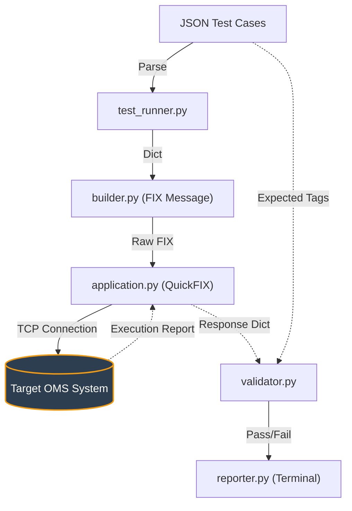

# FIX OMS Test Automation Tool

Connects to your OMS as a FIX 4.4 client, sends messages automatically,
and validates every response tag by tag. No UI. Pure terminal output.

---## What It Tests

| # | File | What It Covers |
|---|------|----------------|
| 01 | `01_new_order.json` | **New Order (35=D)** — valid Buy/Sell Limit with NoParties repeating groups; risk limit rejection (qty > 10000) |
| 02 | `02_cancel.json` | **Cancel (35=F)** — cancel by unknown ClOrdID (reject expected); Cancel-Replace (35=G) flow |
| 03 | `03_cancel_active_order.json` | **Cancel Active Order** — places a live resting order first, then cancels it and confirms OrdStatus=4 |
| 04 | `04_replace_active_order.json` | **Replace Active Order (35=G)** — amends price/qty on a resting order and verifies OrdStatus=5 (Replaced) |
| 05 | `05_fill_scenarios.json` | **Fill Matching** — seeds the book with a Sell, then sends a crossing Buy to trigger a full fill; also tests partial fill where BUY qty < SELL qty |
| 06 | `06_position_request.json` | **Position Request** — queries open positions from the OMS |
| 07 | `07_fok_ioc_experiment.json` | **FOK / IOC** — seeds 3×100 Sell orders; FOK Buy 400 (not enough liquidity → killed); IOC Buy 400 (fills 300, cancels remaining 100) |
| 08 | `08_algo_order.json` | **Algo Order** — sends an algorithmic order and checks OMS acknowledgement |
| 09 | `09_mass_cancel.json` | **Mass Cancel (35=q/r)** — places 2 orders, sends MassCancelRequest by symbol, expects 2 cancel ExecReports + MassCancelReport (35=r) with count=2 |

---

## Project Structure

```
FIX TEST/
├── test.py                           ← Entry point
├── requirements.txt
├── config/
│   ├── client.cfg                    ← FIX session config
│   └── spec/FIX44.xml                ← FIX 4.4 data dictionary
├── fix_client/
│   ├── application.py                ← QuickFIX app (session + response capture)
│   └── builder.py                    ← Builds FIX messages from tag dicts
├── runner/
│   ├── test_runner.py                ← Sends messages, waits for response
│   ├── validator.py                  ← Tag-by-tag comparison
│   └── reporter.py                   ← Prints results in exact format
└── tests/
    ├── 01_new_order.json             ← New Order (35=D) test cases
    ├── 02_cancel.json                ← Cancel (35=F) / Cancel-Replace (35=G)
    ├── 03_cancel_active_order.json   ← Cancel against a live resting order
    ├── 04_replace_active_order.json  ← Replace (35=G) on an active order
    ├── 05_fill_scenarios.json        ← Full and partial fill scenarios
    ├── 06_position_request.json      ← Position request messages
    ├── 07_fok_ioc_experiment.json    ← FOK / IOC order type tests
    ├── 08_algo_order.json            ← Algo / algorithmic order tests
    └── 09_mass_cancel.json          ← Mass Cancel (35=q) / Report (35=r)
```
### Test Framework Architecture



---

## Setup

```bash
# 1. Make sure OMS is running first
Run your oms 

# 2. Install dependency
pip install quickfix==1.15.1
# OR use your existing .whl:
pip install ../quickfix-1.15.1-cp39-cp39-win_amd64.whl

# 3. Run all tests
python test.py

# 4. Run a single test file
python test.py --tests tests/01_new_order.json

# 5. Increase response timeout to 10s
python test.py --timeout 10
```

---

## Output Format

```
══════════════════════════════════════════
 FIX OMS TEST AUTOMATION - RESULTS
══════════════════════════════════════════

[TEST 1] New Order - Valid Buy Limit
  ✅ Tag 35 = "8"    (MsgType)
  ✅ Tag 39 = "0"    (OrdStatus)
  ✅ Tag 55 = "AAPL"    (Symbol)
  ❌ Tag 54 expected "1" got "2"    (Side)
  RESULT: FAILED

[TEST 2] Cancel - Unknown ClOrdID
  ✅ Tag 35 = "9"    (MsgType)
  ✅ Tag 58 = "Unknown Order"    (Text)
  RESULT: PASSED

══════════════════════════════════════════
TOTAL: 2 tests | PASSED: 1 | FAILED: 1
══════════════════════════════════════════
```

---

## Writing Test Cases (JSON)

Each test case has 3 parts:

```json
{
  "name": "test name",
  "send": {
    "35": "D",       ← FIX tag number : value to send
    "55": "AAPL",
    "54": "1",
    "38": "100",
    "44": "150.00",
    "40": "2",
    "21": "1"
  },
  "expect": {
    "35": "8",       ← FIX tag number : expected value in OMS response
    "39": "0",
    "55": "AAPL",
    "54": "1"
  },
  "delay_after": 0.3,  ← optional seconds to wait AFTER this test
  "delay_before": 0.5  ← optional seconds to wait BEFORE sending this test
}
```

Put multiple test cases in one file as a JSON array `[{...}, {...}]`.
Files in `tests/` are loaded alphabetically — prefix with `01_`, `02_` to control order.

---

## Common FIX Tags Reference

| Tag | Name                  | Common Values |
|-----|-----------------------|---------------|
| 35  | MsgType               | D=New, F=Cancel, G=Replace, q=MassCancel, 8=ExecReport, 9=CancelReject, r=MassCancelReport |
| 54  | Side                  | 1=Buy, 2=Sell |
| 38  | OrderQty              | integer |
| 44  | Price                 | decimal |
| 40  | OrdType               | 1=Market, 2=Limit |
| 59  | TimeInForce           | 0=Day, 1=GTC, 3=IOC, 4=FOK |
| 39  | OrdStatus             | 0=New, 1=PartFill, 2=Filled, 4=Canceled, 8=Rejected |
| 150 | ExecType              | 0=New, 1=PartFill, 2=Fill, 4=Canceled, 8=Rejected |
| 55  | Symbol                | e.g. AAPL |
| 58  | Text                  | Free text / reject reason |
| 11  | ClOrdID               | auto-generated if not provided |
| 41  | OrigClOrdID           | required for Cancel (35=F) and Replace (35=G) |
| 14  | CumQty                | Total quantity filled so far |
| 151 | LeavesQty             | Remaining open quantity |
| 453 | NoParties             | Repeating group: number of party entries |
| 448 | PartyID               | Party identifier string |
| 447 | PartyIDSource         | D=Proprietary/Custom |
| 452 | PartyRole             | 1=ExecutingFirm, 76=TradingDesk |
| 530 | MassCancelRequestType | 7=Cancel All Orders |
| 531 | MassCancelResponse    | 7=All Orders Canceled, 0=Rejected |
